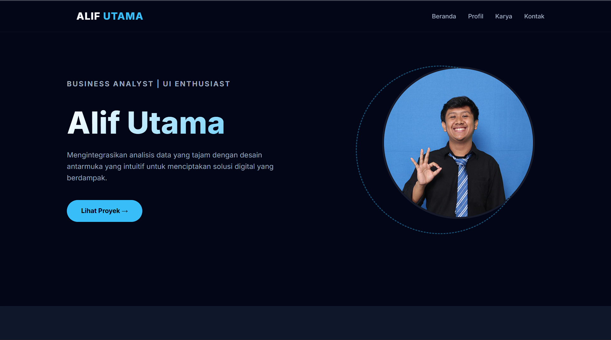
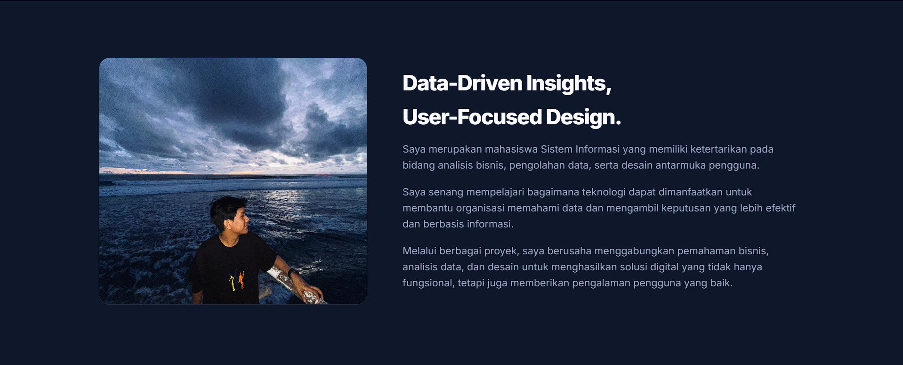
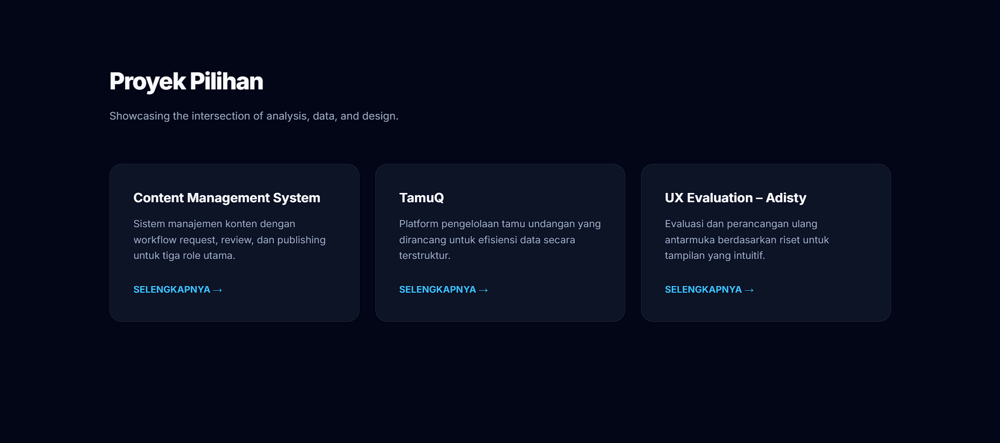
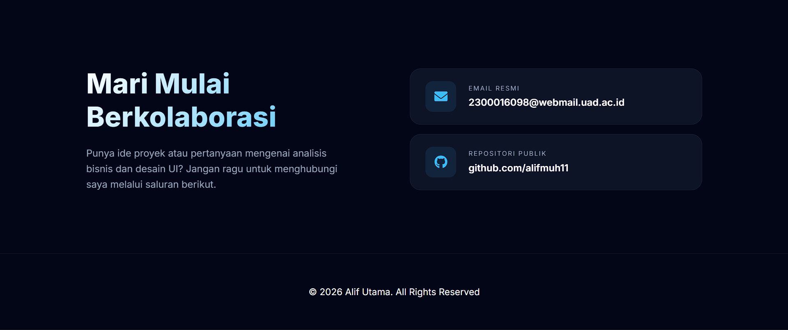

# 🌌 Alif Utama - Professional Portfolio

Selamat datang di repository portofolio digital saya. Proyek ini dibangun untuk menampilkan perpaduan antara **Analisis Bisnis**, **Pengolahan Data**, dan **Desain Antarmuka Pengguna (UI)** yang intuitif.

---

## 🚀 Overview

Portofolio ini dirancang dengan pendekatan **Midnight Tech**, menggunakan palet warna *deep navy* dan *cyan accent* untuk memberikan kesan futuristik namun tetap profesional. Fokus utama proyek ini adalah kecepatan akses (performance) dan interaktivitas yang mulus di berbagai perangkat.

### ✨ Fitur Utama:
- **Responsive Sidebar Menu**: Navigasi mobile yang snappy dengan cakupan layar 65% untuk kenyamanan UX.
- **Interactive Hero Section**: Efek animasi *float* dan spinning element yang memberikan kesan dinamis.
- **Data-Driven Bento Grid**: Menampilkan proyek pilihan dalam tata letak grid modern yang bersih.
- **Glassmorphism Design**: Implementasi efek blur dan transparansi premium pada navbar dan kartu proyek.
- **No-Scrollbar Layout**: Tampilan bersih tanpa gangguan scrollbar browser tradisional.

---

## 🛠️ Tech Stack

Dibuat dengan teknologi web fundamental untuk memastikan performa maksimal:

- **HTML5**: Struktur semantik yang ramah SEO.
- **CSS3 (Custom Variables & Keyframes)**: Animasi kompleks dan desain modular tanpa framework (Pure CSS).
- **JavaScript (Vanilla)**: Logika navigasi, scroll reveal, dan interaksi tanpa library eksternal (Lightweight).
- **Google Fonts**: Inter (Typography standar industri teknologi).
- **FontAwesome**: Ikonografi yang konsisten.

---

## 📸 Tampilan




---

## 📂 Struktur Folder
```text
.
├── assets/
│   ├── img/          # Foto profil dan Gambar
├── index.html        # File utama
├── style.css         # Master styling (Midnight Tech Theme)
├── script.js         # Logika interaksi & animasi
└── README.md         # Dokumentasi proyek